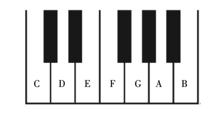
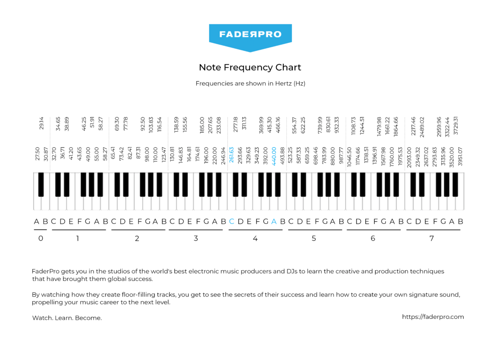
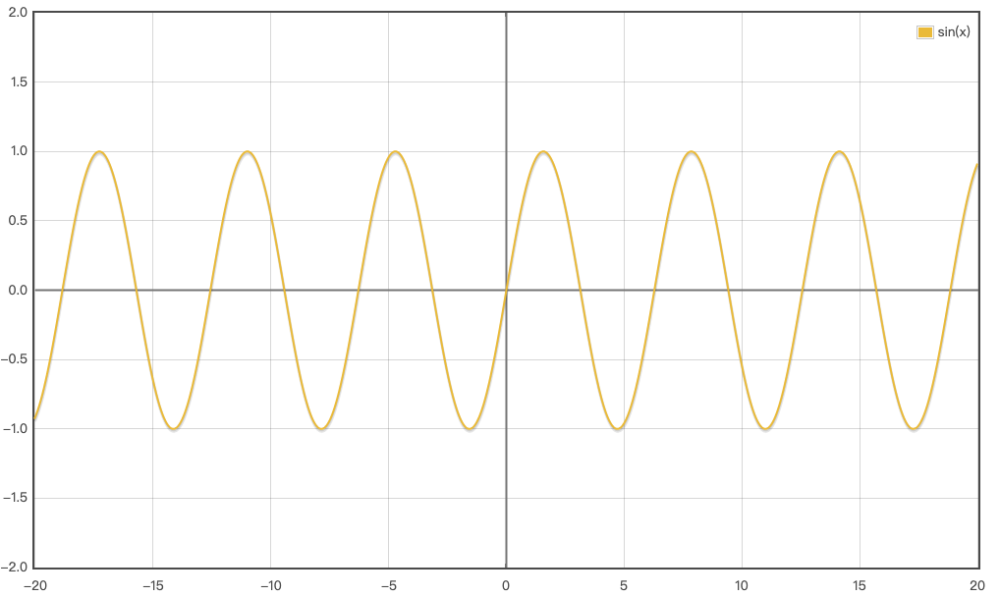
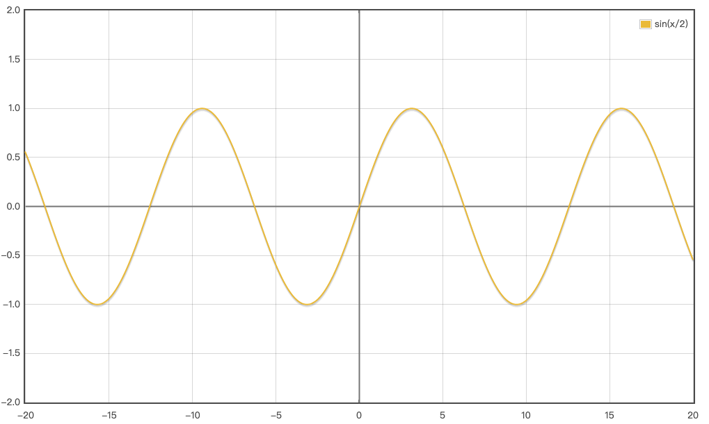
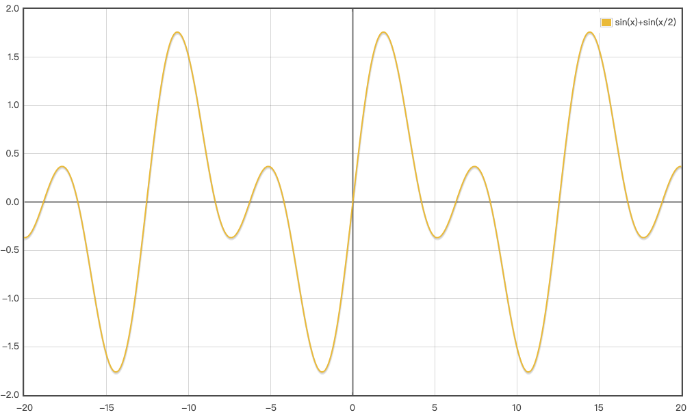

<!--more-->

# 废话前言

* 音乐是由音构成的
* 音是由于物体振动而产生
* 音的四种性质：高低、长短、强弱、音色
* 乐音：规则震动，音的高低明显
* 噪音：不规则震动，音的高低不明显
* 乐音体系：基本乐音的总和
* 音级：乐音体系中的各音
* 人类的听觉范围由音高和响度共同决定。音高的测量单位为赫兹（Hz），响度的测量单位为分贝（dB）。

## 音高（音调，Hz）

我们知道乐音本质就是震动的频率，如果用文字描述，总感觉似是而非，本文用数字替代文字概念，想必会容易理解一些。

### 分类

* 人耳听到的声音：20Hz ～ 20KHz
* 次声波：低于 20Hz
* 超声波：高于 20KHz

人耳听觉的最高频率是15.1KHz，但人可以通过人体和头骨、颅骨将感受到的16～20KHz频率的声波传递给大脑的听觉脑区，因而感受到这个声波的存在  
人类的听力在2KHz-5KHz频率范围内是最敏感的  
[人耳对不同频率声音的感受](https://www.sohu.com/a/163662360_703372)

### 音律

#### 标准规范

**中央 C**：261.6Hz，小字一组c1
**标准音**：440Hz，小字一组的a1

#### 钢琴键盘

官方解释：键盘如图所示，现在的钢琴一般共有 88 个高低不同的音，几乎包括了乐音体系中全部乐音。

钢琴每组一共 12 个键，7 白 5 黑，一共有 12 个音，这就要说一说十二平均律

但我们这里先不解释具体键盘的内容，仍从频率角度开始讲，钢琴键对应的音高如图：

不用说也知道，琴键从左到右，频率次第升高，但是升高的规律是什么？

#### 十二平均律

十二平均律：将一个`八度`平均分成十二等分，每等分称为半音，两份为1个全音。

这个定义涉及到两个问题，什么是八度，怎么平均等分：

##### 八度（Octave）

[维基](https://zh.wikipedia.org/zh-hans/%E5%85%AB%E5%BA%A6) （这里不把维基的解释列出来，纯粹是因为我个人感觉列出来反而不容易理解，有需要自取）

八度：频率比例为 2:1 的两个声音之间的音程。
由频率图可以看到 A2（27.5Hz） - A1（55Hz） - A（110Hz） - a（220Hz） - a1（440Hz） - a2（880Hz）- a3（1760Hz）- a3（3520Hz），都是 2 倍关系。
即 A - A1 为一个八度，同理，a2 - a3 也为一个八度，再同理，c1 - c2 也为一个八度。

这里有个问题，就是为什么要**倍乘**？

sin(x)、sin(x/2)、sin(x/2) + sin(x)  图分别如下所示：

{: width="300px"} + {: width="300px"}  = {: width="300px"}

可见频率倍乘的正弦波的叠加后，其波型也是`规律`的，故：

1. 并不会出现不协调音程中起伏不平的波段，反而能达至互补的作用，因而制造出一份和谐感  
2. 又因人耳在听到纯八度和声时，会有将两个音当成同一个音的倾向  
3. 另一方面，又由于音程所产生的共鸣感，令听者感觉以八度音程行进的旋律，音色会比单旋律的弹奏更为丰富

ps：题外话，为啥规律的波形容易让人产生和谐感？个人猜测可能是规律的震动比较容易被耳膜接受。

以上都是从数学角度讲的，从实际角度出发，其实更简单，就是直接`弦长减半`，而两个音很“和谐”，所以就直接设置为一个基准单位（后来规范名字为八度）

##### 平均等分

下边来说这一个八度的音程，怎么平均等分，答案就是按照`等比`等分，即 x、21/12x、22/12x....2x

那为什么是等比，而不是等差？

##### 为什么是`十二`
最和谐的几个音程：1/2, 2/3, 3/4之中，其最小公倍数就是 12。

#### 五度相生律（三分损益法）

频率相差两倍是八度音，频率相差3/2倍的是纯五度音。