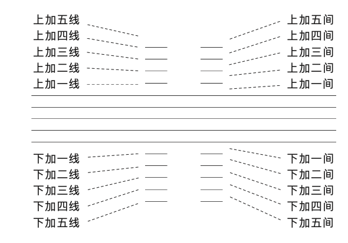
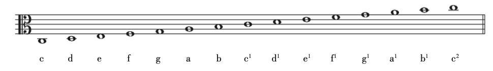

<!--more-->

# 废话前言

五线谱是干嘛的？记谱的，进来看到想必都是码农，你可以简单理解成类似 Java、Python 的语言，只不过形式是鬼画符。

音的长短、强弱、高低

* 五线谱
  * 线
    * 线
    * 间
  * 符
    * 音符
    * 休止符
    * 谱号

## 线

五线谱的五条线，名字如图：

五条线中间的区域称为间，名字如图：

常规的五线之外还有加线 & 加间，如图：

图看完了，我们再解释下意思，一根线表示一个位，一共是五个音位；一个间也是一个音位，一共是四个音位；这9个音位可以用来表示15个音。由下往上，次第升高。

那这些音位的规律是什么呢？

那每个音位是不是有固定音高（固定频率）呢？  
答：No。举个例子，一线并不指某个音高，音高是由“谱号”决定的，后文会解释。  

那相邻音位之间“距离”是固定的么？  
答：看维度。如果纬度指音高，那距离是不固定的，也就是相邻音位之间既非等比也非等差。那距离指什么呢？指的是一个`基本音级`，或者说一个`音名`。  
以CDEFGAB 七个字母命名的音，叫做“基本音级”，而升高一个音位，就是升高一个基本音级。  
需要注意的是：音级之间的距离分别是`全全半全全全半`，全表示一个全音，半表示一个半音。

如果`一线`指 c，那`一间`就是 d，依次推导，`四线`就是 c1 

## 符

### 谱号

常见的谱号分为F谱号、C谱号和G谱号三类。

|  名字  |  符号  |  来由  |  表示音  | 具体位置 |
|---|---|---|---|---|
|F谱号|𝄢|花体字母F|小字组f(174.61Hz)|谱号的两个点夹着的线(间)|
|C谱号|𝄡|花体字母C|小字一组c1(261.63Hz)(中央C)|谱号的两个须须夹着的线(间)|
|G谱号|𝄞|花体的字母G|小字一组g1(392Hz)|谱号的螺旋围绕着的线(间)|

分别如下图所示：

`线 + 间 + 谱号，即可决定该谱每条线（间）的具体频率，即音的高低可以被确定。`

## 参考

基本乐理 - 李重光